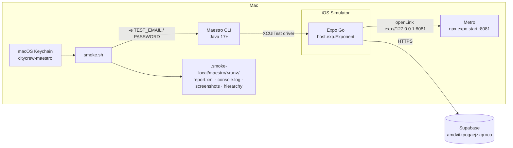

# E2E trên iOS Simulator (Maestro) — tổng quan và kế hoạch mở rộng

Tài liệu này mô tả bộ e2e chạy trên simulator của City Crew: nó kiểm tra gì,
chạy thế nào, những lỗi môi trường đã gặp, và kế hoạch bổ sung flow mới.
Chi tiết cài đặt nằm ở [`app/.maestro/README.md`](../../app/.maestro/README.md),
quy tắc viết flow ở [`app/.maestro/GUIDELINES.md`](../../app/.maestro/GUIDELINES.md).
File này không lặp lại hai file đó; nó là bản đồ và lộ trình.

## 1. Bộ e2e làm gì

Vitest render từng màn hình trong jsdom và kiểm logic. Nó không thấy được app
thật: crash khi mở, tab bar che nút, điều hướng giữa các tab, alert xin quyền,
một vòng gọi Supabase thật (RLS, Edge Function, auth). Bộ Maestro lái **bundle
thật trong Expo Go trên simulator**, gọi **Supabase production**, và chỉ kiểm
những đường mà người dùng không thể thiếu.



## 2. Các flow hiện có

| # | Flow | Trạng thái đăng nhập | Kiểm | Thời gian (26/09) |
|---|---|---|---|---|
| 00 | `launch` | guest | Mở bundle, đóng WelcomeSheet, thấy tab Explore | 22 s |
| 01 | `explore` | guest | Card đầu render, cuộn lên/xuống, đổi thành phố qua city sheet rồi trả lại | 42 s |
| 02 | `place-detail` | guest | Mở card đầu: tên, địa chỉ, ảnh hero; quay lại | 27 s |
| 03 | `search` | guest | Gõ `cafe`, mở kết quả đầu, quay lại, xoá query | 41 s |
| 04 | `sign-in` | test account | Sai mật khẩu báo lỗi; đúng thì vào; cold start vẫn đăng nhập; đăng xuất | 1 m 27 s |
| 05 | `plan-trip` | test account | Wizard Ideas (Friends + 3 mood) → Sketching → plan tốt nhất → lưu → thấy trên Trips → xoá | 1 m 33 s |
| 06 | `save-place` | test account | Lưu place đầu vào collection (tự tạo "Maestro smoke" nếu chưa có), bỏ lưu, đăng xuất | 1 m 14 s |
| 07 | `sign-up-delete` | tài khoản dùng một lần | Đăng ký rồi xoá tài khoản (App Store 5.1.1(v)). **Không chạy tự động** — panel "Use Strong Password?" của iOS nằm ngoài tầm Maestro; QA tay mỗi release | — |

Subflow dùng chung (`common/`): `start` (kill Expo Go, mở lại, cấp quyền
notification), `dismiss-welcome`, `expo-go-prep` (tắt nút bánh răng của Expo
Go), `ensure-signed-in`, `ensure-signed-out`, `sign-in`, `delete-first-trip`.

**Kết quả gần nhất:** 26/09/2026, iPhone 17 · iOS 26.5 · Expo Go SDK 57, code
tại `001f75af` (main `da8c8f7` + nhánh `release/1.0.4-coverage`) —
**7/7 passed trong 6 m 27 s**.

## 3. Chạy

```sh
# Tab 1 — simulator + Metro (để chạy suốt)
xcrun simctl list devices booted            # đã có máy nào boot chưa
open -a Simulator
cd app && npx expo start                    # bấm i một lần để Expo Go mở app

# Tab 2 — bộ smoke
cd app && npm run smoke:ios                         # 7 flow (00–06)
npm run smoke:ios -- .maestro/05-plan-trip.yaml     # một flow
open ../.smoke-local/maestro/latest                 # xem kết quả
```

Trước khi chạy: `git fetch && git log --oneline HEAD..origin/main` phải rỗng,
nếu không thì merge rồi bấm `r` ở tab Metro — nếu không bộ test đang kiểm code cũ.

## 4. Sự cố môi trường đã gặp (26/09) và cách xử lý

| Triệu chứng | Nguyên nhân | Xử lý |
|---|---|---|
| `Invalid device or device pair: iPhone 16` | Simulator đang dùng là iPhone 17; lệnh `boot` cố định tên máy | Bỏ qua nếu đã có máy boot; không cần đúng tên |
| `ERROR: Java 17 or higher is required` | `JAVA_HOME` trỏ vào Zulu 8 (giữ cho project khác); `smoke.sh` chỉ tự chọn JDK khi `JAVA_HOME` rỗng | `smoke.sh` giờ bỏ qua `JAVA_HOME` < 17 và chọn `java_home -v 17+` cho lần chạy đó |
| 7/7 fail: `id: gearshape.fill is not visible` | Menu dev mới của Expo Go 57: trượt lên chậm một nhịp, và dòng "Tools button" nằm dưới cùng mục TOOLS, phải cuộn mới thấy. Flow tap trượt, lại còn bật/tắt qua lại giữa các flow | `common/expo-go-prep.yaml` viết lại: chỉ chạy khi bánh răng đang hiện, chờ menu, cuộn tới dòng, tap công tắc (không còn optional), cuộn lên, Reload |
| `tab-explore is not visible` sau prep | Menu Expo Go mở muộn, che tab bar | Như trên — chờ `Reload` hiện rồi mới thao tác |

Bài học: một bước `optional` tap trượt thì im lặng, và lỗi hiện ra ở một assert
xa phía sau. Bước nào là điều kiện cho cả suite thì không để `optional`.

## 5. Độ phủ hiện tại


Xanh: đã có flow. Vàng: QA tay. Cam: chưa có.

## 6. Kế hoạch bổ sung

Nguyên tắc chọn flow (từ GUIDELINES): chỉ thêm đường mà **hỏng thì người dùng
không dùng được app**, và **vitest không phủ được**. Mỗi flow tốn ~1 phút; ngân
sách toàn suite ≤ 12 phút.

### Đợt 1 — những gì 1.0.4 vừa đổi (ưu tiên cao)

| Flow mới | Đăng nhập | Kiểm | testID cần thêm | Ghi chú |
|---|---|---|---|---|
| `08-explore-filter` ✅ viết xong 26/09 | guest | Ghim vị trí Hà Nội; sort theo khoảng cách, thêm "đang mở", số bộ lọc trên nút đúng, Reset trả về như cũ | `filter-sort-*`, `filter-status-*`, `filter-saved`, `filter-reset`, `filter-apply`, `filter-close` (đã thêm; đếm qua số trong nhãn nút `explore-filter`, vì badge bên trong nút không lên cây trợ năng iOS) | Bản đồ **không test được trong Expo Go**: `canDrawMap` = false trên iOS store client (không có Google Maps key), nút `explore-view` không được vẽ. Phần map chuyển sang đợt 3 (dev client) |
| `09-collections-browse` | guest | Tab Collections: collection cộng đồng đầu tiên → detail → place đầu → quay về; cũng mở từ "From the community" trên Explore | `collection-card-<i>`, `collection-place-<i>`, `collection-back` | Hiện Collections/CollectionDetail chưa có testID nào ngoài banner lỗi |
| `10-place-detail-deep` | guest | Mở place có map + giờ mở cửa: `detail-facts` hiện, MiniMap hiện, `detail-directions` mở action sheet (không rời app), gallery mở và đóng | `detail-minimap`, `detail-hours`, `detail-gallery` | Nối dài 02 thay vì flow riêng nếu muốn tiết kiệm thời gian |

### Đợt 2 — tài khoản và dữ liệu của người dùng

| Flow mới | Đăng nhập | Kiểm | testID cần thêm |
|---|---|---|---|
| `11-collection-crud` | test account | Tạo collection "Maestro CRUD", đổi tên, thêm 1 place, xoá place, xoá collection; dọn "Maestro CRUD" còn sót trước khi chạy | `collection-more`, `collection-rename`, `collection-delete`, `collection-row-<i>` |
| `12-language` | guest | Profile → ngôn ngữ → Tiếng Việt: tab bar đổi nhãn ("Khám phá"); mở Explore và place detail không crash; → 日本語; trả về English. Đây là chỗ duy nhất được assert theo label — chính label là thứ đang kiểm | `profile-language`, `lang-<en\|vi\|ja>` |
| `13-trip-edit` | test account | Lưu một trip (dùng lại phần đầu của 05), mở detail, đổi giờ/đổi thứ tự điểm, lưu, kiểm thay đổi còn sau cold start, xoá | `trip-edit`, `trip-stop-<i>`, `trip-save` |
| `14-forgot-password` | guest | Sign in → quên mật khẩu → nhập email test → thấy màn xác nhận (không đọc mail) | `signin-forgot`, `forgot-email`, `forgot-submit`, `forgot-sent` |

### Đợt 3 — cần hạ tầng mới

| Việc | Vì sao cần | Đề xuất |
|---|---|---|
| Chạy lại `sign-up-delete` tự động | App Store 5.1.1(v) đang chỉ có QA tay | Tắt AutoFill password suggestions riêng trên simulator smoke (Settings → Passwords → Password Options), thử lại flow; nếu được thì đưa vào `config.yaml` với tag `slow` |
| Mời bạn vào trip / Crew | Cần hai tài khoản đăng nhập cùng lúc | Tài khoản test thứ hai trong Keychain (`citycrew-maestro-2`); flow A mời, flow B chấp nhận qua `TripInvitationScreen` |
| Local guide (ảnh, cover, ẩn ảnh) | Cần quyền guide, ghi vào dữ liệu thật | Chỉ làm khi có Supabase staging; không cấp quyền guide cho test account trên production |
| Deep link `citycrew://place/<id>` | Link chia sẻ là đường vào của người dùng mới | Cần dev client (Expo Go không nhận scheme của app) |
| Explore map (`explore-view`, `places-map`, pin → `MapPlaceCard`) | Pin có ảnh là tính năng chính của 1.0.4 | Cần dev client có Google Maps key (`npx expo run:ios`), suite thứ hai với `appId: com.aletuan.citycrew`. Chế độ list/map lưu trong AsyncStorage (`VIEW_KEY`) — flow phải trả về list ở cuối |
| Mất mạng / `*-load-fail` | Banner lỗi và retry | `xcrun simctl` không tắt mạng được; dùng Network Link Conditioner hoặc biến môi trường ép lỗi trong bundle dev |
| CI nightly | Không phụ thuộc máy Andy | macOS runner + `eas build --profile development` + Supabase staging + secrets |

### Hạ tầng suite (làm song song đợt 1)

1. **Tag flow** (`guest`, `signed-in`, `slow`) để chạy nhanh phần guest trước
   release OTA: `npm run smoke:ios -- --include-tags guest`.
2. **`maestro check-syntax` + `maestroIds.test.ts` trong CI** đã có; thêm kiểm
   mọi flow trong `config.yaml` đều tồn tại và ngược lại.
3. **Cập nhật README**: bỏ tên máy cố định trong lệnh `boot`, ghi chú Expo Go 57
   menu và Java.
4. **Chạy smoke trước mỗi lần bump version** — ghi vào checklist release
   (`docs/store/review-notes.md`).

### Định nghĩa "xong" cho mỗi flow mới

- testID mới thêm qua prop `testID`, có trong bảng README, `npm test` xanh.
- Dọn dữ liệu sót trước khi chạy, dọn dữ liệu của mình sau khi chạy.
- Xanh **hai lần liên tiếp** trên simulator (lần hai chứng minh phần dọn dẹp).
- Tổng thời gian suite ghi lại ở mục 2.
