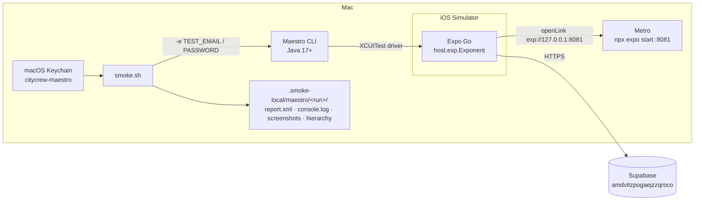

# E2E trên iOS Simulator (Maestro) — tổng quan và kế hoạch mở rộng

Tài liệu này mô tả bộ e2e chạy trên simulator của City Crew: nó kiểm tra gì,
chạy thế nào, những lỗi môi trường đã gặp, và kế hoạch bổ sung flow mới.
Chi tiết cài đặt nằm ở [`app/.maestro/README.md`](../../app/.maestro/README.md),
quy tắc viết flow ở [`app/.maestro/GUIDELINES.md`](../../app/.maestro/GUIDELINES.md).
File này không lặp lại hai file đó; nó là bản đồ và lộ trình.

## 1. Bộ e2e làm gì

Vitest render từng màn hình trong jsdom và kiểm logic. Nó không thấy được app
thật: crash khi mở, tab bar che nút, điều hướng giữa các tab, alert xin quyền,
một vòng gọi Supabase thật (RLS, Edge Function, auth). Bộ Maestro lái **bundle
thật trong Expo Go trên simulator**, gọi **Supabase production**, và chỉ kiểm
những đường mà người dùng không thể thiếu.

```mermaid
flowchart LR
  subgraph Mac
    K[macOS Keychain<br/>citycrew-maestro] --> S[smoke.sh]
    S -->|-e TEST_EMAIL / PASSWORD| M[Maestro CLI<br/>Java 17+]
    Metro[Metro<br/>npx expo start :8081]
    subgraph Sim[iOS Simulator]
      EG[Expo Go<br/>host.exp.Exponent]
    end
    M -->|XCUITest driver| EG
    EG -->|openLink exp://127.0.0.1:8081| Metro
    S --> R[.smoke-local/maestro/&lt;run&gt;/<br/>report.xml · console.log · screenshots · hierarchy]
  end
  EG -->|HTTPS| SB[(Supabase<br/>amdvitzpogaejzzqroco)]
```

## 2. Các flow hiện có

Danh sách và thứ tự nằm ở `app/.maestro/config.yaml`; flow nào kiểm những gì,
cùng các subflow trong `common/`, thì
[`README.md`](../../app/.maestro/README.md) có bảng đầy đủ. Ở đây chỉ ghi thứ
hai file kia không có: **thời gian đo được**, vì đó là ngân sách của cả suite.

| Flow | Đăng nhập | Thời gian (09/10) |
|---|---|---|
| `00-launch` | guest | 28 s |
| `01-explore` | guest | 47 s |
| `02-place-detail` | guest | 30 s |
| `03-search` | guest | 42 s |
| `04-sign-in` | test account | 1 m 39 s (chạy riêng) |
| `05-plan-trip` | test account | 1 m 50 s |
| `06-save-place` | test account | 1 m 21 s |
| `08-explore-filter` | guest | 50 s |
| `09-collections-browse` | guest | 42 s |
| `10-check-in` | test account | 1 m 9 s |
| `11-collection-crud` | test account | 2 m |
| `13-trip-edit` | test account | 1 m 49 s |
| `14-forgot-password` | guest | 1 m 11 s |
| `12-language` | guest | 1 m 43 s |
| `07-sign-up-delete` | dùng một lần | không chạy tự động — QA tay mỗi release |

**Kết quả gần nhất:** 10/10/2026, iPhone 17 · iOS 26.5 · Expo Go — **14/14
passed trong 16 m 36 s**, với `13-trip-edit` vừa vào. Trước đó cùng ngày:
13/13 trong 15 m 7 s trên `0d120779` (main, đã gồm #848–#855).

Một lượt suite trong lúc làm `13` đỏ ở `11`: `hideKeyboard` đã tự gửi form
tạo collection (ô tên gửi khi bấm return), màn hình đóng trước khi flow bấm
`collection-submit`. `11` giờ chỉ bấm nút nếu nó còn trên màn hình.

Trước đó cùng ngày `11-collection-crud` đỏ liền nhiều lượt, kể cả sau khi
khởi động lại simulator. Nguyên nhân đã đo được: sau khi một `Alert` hệ thống
đã hiện trong phiên, menu `⋯` của chủ collection đọc ra cây giao diện rỗng
với XCUITest (phiên mới: đọc được; huỷ một hộp xoá rồi mở lại: không). Một
lượt suite bị driver mất kết nối đã để lại "Maestro CRUD" trên tài khoản
test; từ đó phần dọn dẹp của `11` luôn bật hộp xoá *trước* khi mở menu để
đổi tên, hỏng, và để lại một list nữa — vòng lặp nằm ở dữ liệu tài khoản,
không ở máy. `11` giờ mở lại app sau khi dọn (xanh hai lượt: một có list
sót, một sạch); GUIDELINES có quy tắc 11a. Có thể đây cũng là lỗi với
VoiceOver trên máy thật — chưa kiểm.

Các lượt trước: 12/12 trong 13 m 38 s (10/10, `12-language` vào); 11/11 trong
12 m 11 s (09/10, `10-check-in` vào); 10/10 trong 11 m 29 s (09/10, `09` và
`11` vào). Một lượt `11` ngày 09/10 hỏng ở bước đăng nhập với "No
connection" — mạng giữa simulator và Supabase; lượt sau xanh.

Cùng ngày, `04-sign-in` chập chờn đã được sửa: `common/ensure-signed-out.yaml`
cuộn lên `profile-sign-in` không có `centerElement`, nên đôi khi dừng với nút
nằm dưới thanh trạng thái, và cú chạm rơi vào thanh trạng thái (iOS hiểu là
"cuộn về đầu"). Thêm `centerElement: true` rồi `04` xanh bốn lượt liền.

**Ngân sách: dưới 20 phút** cho cả suite (quyết định của chủ dự án,
09/10). Thời gian không phải ràng buộc chặt: một flow đáng giá vẫn vào dù
làm suite dài thêm một hai phút. 14 flow hiện chạy 16 m 36 s, còn khoảng
3 phút cho các flow tiếp theo.

`10-check-in` được thử cả nhánh dọn dẹp: một flow tạm check-in rồi dừng, `10`
dọn lượt ghé đó rồi chạy hết (1 m 5 s); lượt sau từ trạng thái sạch (51 s);
truy vấn `checkins` của tài khoản test sau đó: 0 dòng.

## 3. Chạy

Lệnh chạy và cách đọc kết quả: [`README.md`](../../app/.maestro/README.md),
mục *Running* và *Reading a failure*.

Một điều kiện chỉ ghi ở đây, vì nó thuộc về lúc chạy chứ không thuộc về công
cụ: trước khi chạy, `git fetch && git log --oneline HEAD..origin/main` phải
rỗng. Nếu không thì merge rồi bấm `r` ở tab Metro — bằng không bộ test đang
kiểm code cũ, và một lần xanh không nói lên điều gì.

## 4. Sự cố môi trường đã gặp (26/09) và cách xử lý

| Triệu chứng | Nguyên nhân | Xử lý |
|---|---|---|
| `Invalid device or device pair: iPhone 16` | Simulator đang dùng là iPhone 17; lệnh `boot` cố định tên máy | Bỏ qua nếu đã có máy boot; không cần đúng tên |
| `ERROR: Java 17 or higher is required` | `JAVA_HOME` trỏ vào Zulu 8 (giữ cho project khác); `smoke.sh` chỉ tự chọn JDK khi `JAVA_HOME` rỗng | `smoke.sh` giờ bỏ qua `JAVA_HOME` < 17 và chọn `java_home -v 17+` cho lần chạy đó |
| 7/7 fail: `id: gearshape.fill is not visible` | Menu dev mới của Expo Go 57: trượt lên chậm một nhịp, và dòng "Tools button" nằm dưới cùng mục TOOLS, phải cuộn mới thấy. Flow tap trượt, lại còn bật/tắt qua lại giữa các flow | `common/expo-go-prep.yaml` viết lại: chỉ chạy khi bánh răng đang hiện, chờ menu, cuộn tới dòng, tap công tắc (không còn optional), cuộn lên, Reload |
| `tab-explore is not visible` sau prep | Menu Expo Go mở muộn, che tab bar | Như trên — chờ `Reload` hiện rồi mới thao tác |

Bài học: một bước `optional` tap trượt thì im lặng, và lỗi hiện ra ở một assert
xa phía sau. Bước nào là điều kiện cho cả suite thì không để `optional`.

## 5. Độ phủ hiện tại

```mermaid
flowchart TB
  classDef ok fill:#1f6f43,color:#fff,stroke:#1f6f43
  classDef gap fill:#8a3b12,color:#fff,stroke:#8a3b12
  classDef man fill:#6b5b12,color:#fff,stroke:#6b5b12
  E[Explore list]:::ok
  C[City sheet]:::ok
  PD[Place detail]:::ok
  S[Search]:::ok
  SI[Sign in / out]:::ok
  PT[Ideas → Plan → Save trip]:::ok
  SP[Save place]:::ok
  SU[Sign up + delete account]:::man
  FILT[Explore filter + sort]:::ok
  MAP[Explore map + pin ảnh]:::gap
  COL[Collections tab + detail]:::ok
  CC[Tạo/sửa/xoá collection]:::ok
  LANG[Đổi ngôn ngữ VI/JA]:::ok
  PE[Sửa kế hoạch trước khi lưu]:::ok
  TD[Trip detail: mời bạn]:::gap
  FP[Quên mật khẩu]:::ok
  LG[Local guide: ảnh, cover]:::gap
  DL[Deep link place/trip]:::gap
  LF[Mất mạng / load-fail]:::gap
  CI[Check-in tại một địa điểm]:::ok
```

Xanh: đã có flow. Vàng: QA tay. Cam: chưa có.

## 6. Kế hoạch bổ sung

Nguyên tắc chọn flow (từ GUIDELINES): chỉ thêm đường mà **hỏng thì người dùng
không dùng được app**, và **vitest không phủ được**. Mỗi flow tốn ~1 phút; ngân
sách toàn suite < 20 phút (xem mục 2).

### Đợt 1 — những gì 1.0.4 vừa đổi (ưu tiên cao)

| Flow mới | Đăng nhập | Kiểm | testID cần thêm | Ghi chú |
|---|---|---|---|---|
| `08-explore-filter` ✅ viết xong 26/09 | guest | Ghim vị trí Hà Nội; sort theo khoảng cách, thêm "đang mở", số bộ lọc trên nút đúng, Reset trả về như cũ | `filter-sort-*`, `filter-status-*`, `filter-saved`, `filter-reset`, `filter-apply`, `filter-close` (đã thêm; đếm qua số trong nhãn nút `explore-filter`, vì badge bên trong nút không lên cây trợ năng iOS) | Bản đồ **không test được trong Expo Go**: `canDrawMap` = false trên iOS store client (không có Google Maps key), nút `explore-view` không được vẽ. Phần map chuyển sang đợt 3 (dev client) |
| `09-collections-browse` ✅ xong 09/10 | guest | Tab Collections: collection cộng đồng đầu tiên → detail → place đầu → quay về; cũng mở từ "From the community" trên Explore | `collection-card-<i>`, `collection-place-<i>`, `collection-back` | Hiện Collections/CollectionDetail chưa có testID nào ngoài banner lỗi |
| `10-place-detail-deep` | guest | Mở place có map + giờ mở cửa: `detail-facts` hiện, MiniMap hiện, `detail-directions` mở action sheet (không rời app), gallery mở và đóng | `detail-minimap`, `detail-hours`, `detail-gallery` | Nối dài 02 thay vì flow riêng nếu muốn tiết kiệm thời gian |

### Đợt 2 — tài khoản và dữ liệu của người dùng

| Flow mới | Đăng nhập | Kiểm | testID cần thêm |
|---|---|---|---|
| `11-collection-crud` ✅ xong 09/10 | test account | Tạo collection "Maestro CRUD", đổi tên, thêm 1 place, xoá place, xoá collection; dọn "Maestro CRUD" còn sót trước khi chạy | `collection-more`, `collection-rename`, `collection-delete`, `collection-row-<i>` |
| `12-language` ✅ xong 10/10 | guest | Profile → ngôn ngữ → Tiếng Việt: tab bar đổi nhãn ("Khám phá"); mở Explore và place detail không crash; → 日本語; trả về English. Đây là chỗ duy nhất được assert theo label — chính label là thứ đang kiểm | `profile-language`, `lang-<en\|vi\|ja>` |
| `13-trip-edit` ✅ xong 10/10 | test account | Trip đã lưu không có màn sửa (chỉ mời bạn và xoá), nên phần sửa là của kế hoạch, trước Save: lập kế hoạch như 05 → trong màn sửa đọc giờ điểm đầu, lùi 15 phút → lưu → trip đã lưu mang đúng giờ mới, và vẫn vậy sau cold start → xoá. Đổi thứ tự bằng cách kéo chưa được thử với Maestro | `plan-stop-time-<i>`, `plan-stop-earlier-<i>`, `trip-stop-time-<i>` |
| `14-forgot-password` ✅ xong 10/10 | guest | Sign in → quên mật khẩu → xin mã cho `maestro-reset@example.com` (tên miền dành riêng: không tài khoản, không thư — **không** dùng email test, vì đó là hộp thư Gmail thật) → tới bước nhập mã → bấm Reset khi chưa có mã, form từ chối và ở lại. Chưa tới được việc server từ chối mã sai: ô mật khẩu mới bật bảng "Use Strong Password?" của iOS | `signin-forgot`, `forgot-email`, `forgot-submit`, `forgot-code`, `forgot-resend`, `forgot-reset` |

### Đợt 3 — cần hạ tầng mới

| Việc | Vì sao cần | Đề xuất |
|---|---|---|
| Chạy lại `sign-up-delete` tự động | App Store 5.1.1(v) đang chỉ có QA tay | Tắt AutoFill password suggestions riêng trên simulator smoke (Settings → Passwords → Password Options), thử lại flow; nếu được thì đưa vào `config.yaml` với tag `slow` |
| Mời bạn vào trip / Crew | Cần hai tài khoản đăng nhập cùng lúc | Tài khoản test thứ hai trong Keychain (`citycrew-maestro-2`); flow A mời, flow B chấp nhận qua `TripInvitationScreen` |
| Local guide (ảnh, cover, ẩn ảnh) | Cần quyền guide, ghi vào dữ liệu thật | Chỉ làm khi có Supabase staging; không cấp quyền guide cho test account trên production |
| Deep link `citycrew://place/<id>` | Link chia sẻ là đường vào của người dùng mới | Cần dev client (Expo Go không nhận scheme của app) |
| Explore map (`explore-view`, `places-map`, pin → `MapPlaceCard`) | Pin có ảnh là tính năng chính của 1.0.4 | Cần dev client có Google Maps key (`npx expo run:ios`), suite thứ hai với `appId: com.aletuan.citycrew`. Chế độ list/map lưu trong AsyncStorage (`VIEW_KEY`) — flow phải trả về list ở cuối |
| Mất mạng / `*-load-fail` | Banner lỗi và retry | `xcrun simctl` không tắt mạng được; dùng Network Link Conditioner hoặc biến môi trường ép lỗi trong bundle dev |
| CI nightly | Không phụ thuộc máy Andy | macOS runner + `eas build --profile development` + Supabase staging + secrets |

### Hạ tầng suite (làm song song đợt 1)

1. **Tag flow** (`guest`, `signed-in`, `slow`) để chạy nhanh phần guest trước
   release OTA: `npm run smoke:ios -- --include-tags guest`.
2. **`maestro check-syntax` + `maestroIds.test.ts` trong CI** đã có; thêm kiểm
   mọi flow trong `config.yaml` đều tồn tại và ngược lại.
3. ~~**Cập nhật README**: bỏ tên máy cố định trong lệnh `boot`, ghi chú Expo Go
   57 menu và Java.~~ — xong: lệnh `boot` dùng `"<name>"`, mục *One-time setup*
   nói Java 17+, và phần subflow nói về menu TOOLS của Expo Go 57.
4. **Chạy smoke trước mỗi lần bump version** — ghi vào checklist release
   (`docs/store/review-notes.md`).

### Định nghĩa "xong" cho mỗi flow mới

- testID mới thêm qua prop `testID`, có trong bảng README, `npm test` xanh.
- Dọn dữ liệu sót trước khi chạy, dọn dữ liệu của mình sau khi chạy.
- Xanh **hai lần liên tiếp** trên simulator (lần hai chứng minh phần dọn dẹp).
- Tổng thời gian suite ghi lại ở mục 2.
